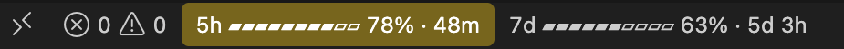
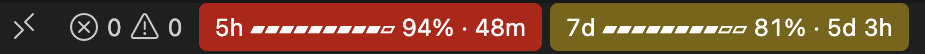

# Usage Bar for Claude Code

Your Claude Code 5-hour and weekly usage, always in VS Code's status bar. No more typing `/usage`.


## What it shows

```
5h ▰▰▰▰▰▰▱▱▱▱ 62% · 48m   7d ▰▰▰▰▰▰▰▱▱▱ 73% · 5d 3h
```

- **Each window** your plan has: the 5-hour window and the week (and a spend limit, if your organization sets one), how
  much of each you've used, and how long until it resets.
- **Yellow from 75%, red from 90%,** on the window that's filling up.
- **Hover** for the details and when Claude Code last reported them.





## Getting started

1. **Install the extension.** VS Code installs Claude Code with it if you don't have it yet.
2. **Click Install** when it asks to add its Claude Code plugin. That's the only setup.
3. **Keep talking to Claude.** Your usage appears after Claude's next reply. In a chat that was already open, run
   `/reload-plugins` first.

You need a Claude Pro or Max plan: on other plans Claude Code has no usage limits to report.

## How it works

Claude Code learns your usage limits from Claude's replies, but its VS Code panel doesn't show them. Usage Bar adds a
small Claude Code plugin that saves them to `~/.claude/usage-bar.json` after each reply, and the status bar shows that
file.

- **One click to set up.** The extension runs Claude Code's own `claude plugin` commands, which fetch the plugin from
  this repo. It's updated with the extension, and uninstalling the extension removes it and the file.
- **Only what Claude Code already knows.** Writing that one file is all the plugin does
  ([`plugin/hooks/register.ts`](plugin/hooks/register.ts), about 50 lines), and the extension reads it.

## Known limitations

- **Your usage shows after Claude replies.** Claude Code only learns your limits from its replies, so right after
  installing there's nothing to show until the next one.
- **Usage from elsewhere shows with your next reply here.** Claude on the web or another computer counts toward the same
  limits, but this bar only learns of it from Claude Code's next reply in VS Code.
- **A moved Claude config folder.** If you set `CLAUDE_CONFIG_DIR` in your shell and start VS Code from the Dock, VS
  Code doesn't see it, and the plugin installs to `~/.claude` instead, where Claude Code won't load it. Start VS Code
  from that shell (`code .`) and install from there.

## Contributing

Issues are welcome: bugs, ideas, setups where it doesn't work. I'm not accepting pull requests for now, so please open
an issue instead.

## License

[MIT](LICENSE)
