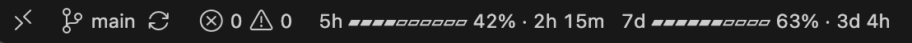

# Usage Bar for Claude Code

Your Claude Code 5-hour and weekly usage, always in VS Code's status bar. No more typing `/usage`.

**It never reads your Claude login and makes no network requests.** It shows what Claude Code already knows about your
limits, written by a small Claude Code plugin it installs for you.



## What it shows

```
5h ▰▰▰▰▰▰▱▱▱▱ 62% · 48m   7d ▰▰▰▰▰▰▰▱▱▱ 73% · 5d 3h
```

- **Each window** your plan has: the 5-hour window and the week, how much of each you've used, and how long until it
  resets.
- **Yellow from 75%, red from 90%,** on whichever window is fuller.
- **Hover** for the details and when Claude Code last reported them.

## Getting started

1. **Install the extension.** VS Code installs Claude Code with it if you don't have it yet.
2. **Click Install** when it asks to add its Claude Code plugin. That's the only setup.
3. **Keep talking to Claude.** Your usage appears after Claude's next reply. In a chat that was already open, run
   `/reload-plugins` first.

You need a Claude Pro or Max plan: on other plans Claude Code has no usage limits to report.

## How it works

Claude Code knows your rate limits from its replies, but its VS Code panel doesn't show them, and an extension can't ask
Claude Code for them. So the extension installs a Claude Code plugin (`plugin/` in this repo) that writes your limits to
`~/.claude/usage-bar.json` whenever a reply moves them, and the extension shows that file in the status bar.

- **Nothing leaves your machine.** The plugin writes one small file; the extension reads it.
- **No credentials.** Neither reads your Claude login, a token or a cookie.
- **Uninstalling the extension removes the plugin** and the file.

## Known limitations

- **Your usage shows after Claude replies.** Claude Code only learns your limits from its replies, so right after
  installing there's nothing to show until the next one.
- **A moved Claude config folder.** If you set `CLAUDE_CONFIG_DIR` in your shell and start VS Code from the Dock, VS
  Code doesn't see it, and the plugin installs to `~/.claude` instead, where Claude Code won't load it. Start VS Code
  from that shell (`code .`) and install from there.

## Contributing

Issues are welcome: bugs, ideas, setups where it doesn't work. I'm not accepting pull requests for now, so please open
an issue instead.

## License

[MIT](LICENSE)
